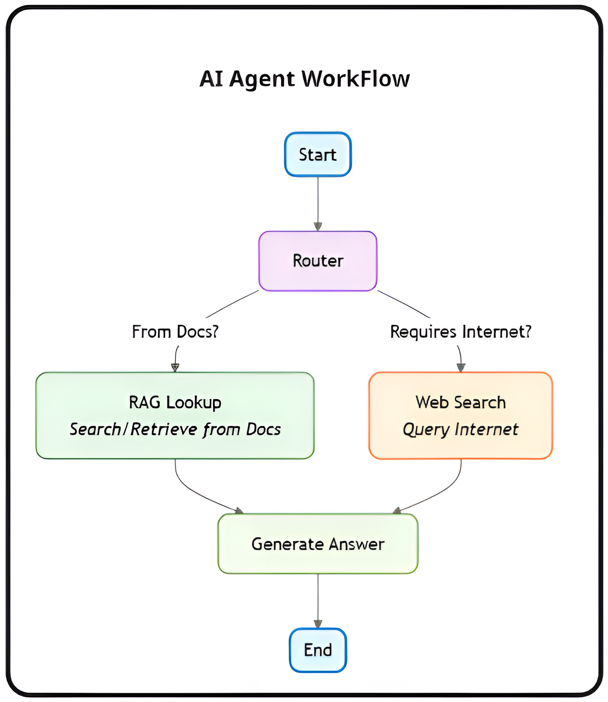

# 🤖 DocuMind: LangGraph-Powered Hybrid RAG and Real-Time Search Agent


This repository hosts the code for **DocuMind**, an advanced AI Agent application designed to answer user queries by seamlessly integrating a private knowledge base (via Retrieval-Augmented Generation - RAG) with real-time web search. The system gives users full control over when to use online search, ensuring both flexibility and transparency.

<p align="center">
  
</p>

---

## ✨ Key Features

- **Hybrid Intelligence & Smart Routing**: Automatically determines whether to use internal RAG knowledge or external web search for each query..

- **User-Controlled Web Search**: Simple UI toggle to enable/disable internet access, letting users choose between private-only knowledge or extended real-time search..

- **Transparent AI Thought Process (Agent Trace)**: Displays a step-by-step breakdown of the agent’s reasoning, routing decisions, and retrieved context, ensuring clear insights into the AI’s workflow.

- **Context-Aware Sufficiency Detection**: LLM-powered judgment verifies whether RAG results are enough to answer a query, and falls back to web search if needed to avoid incomplete answers.

- **Dynamic Knowledge Ingestion (PDF Upload)**: Users can upload PDF documents directly, which are automatically processed, embedded, and added to the agent's Pinecone knowledge base.

-  **Extensible Modular Architecture**: Organized into layers (FastAPI, LangGraph, Streamlit) that are easy to debug, scale, and enhance.

-  **Persistent Conversation Memory**: LangGraph checkpointing preserves session context across multiple user-agent interactions.

---
  
## 🚀 High-Level Architecture

## 🧩 System Layers

- **Frontend (UI)**: Streamlit interface for seamless interaction.
    
- **API Layer**: FastAPI backend that manages requests and responses.
    
- **Agent Core**: LangGraph-driven orchestration for reasoning and routing.
    
- **Knowledge Base**: Pinecone vector database with HuggingFace embeddings.
    
- **External Tools**: Groq LLM and Tavily Search API for enhanced intelligence.

---

## Application Workflow
The end-to-end workflow includes: session initialization → query intake → intelligent routing → RAG or web search → answer composition → trace logging → response delivery to the UI.

<p align="center">
  
</p>

---

## AI Agent Workflow

The system uses LangGraph to evaluate whether the available context is sufficient. Based on this assessment, it intelligently routes queries to either the embedded RAG pipeline or live web search, while maintaining complete and transparent trace logs.

<p align="center">
  
</p>

---

## RAG Pipeline 

PDFs are split, embedded, stored in Pinecone, and served for lightning-fast contextual retrieval on demand.

<p align="center">
  
</p>

---

## 📦  Project Structure

```
DocuMind/
├── frontend/
│   ├── app.py                  # Streamlit entry point
│   ├── ui_components.py       # Chat UI, toggle, trace
│   ├── backend_api.py         # API communication
│   ├── session_manager.py     # Streamlit state management
│   └── config.py              # Frontend config
│
├── backend/
│   ├── main.py                # FastAPI entry point
│   ├── agent.py               # LangGraph AI agent workflow
│   ├── vectorstore.py         # Pinecone RAG logic
│   └── config.py              # API keys and env vars
│
│
├── requirements.txt          # Python dependencies
└── .env                      # API keys (not committed)
```

---

## ⚙️ Technology Stack

- **Language**: Python 3.9+
- **Frontend**: Streamlit
- **Backend**: FastAPI
- **Agent Orchestration**: LangGraph
- **LLMs & Tools**: LangChain, Groq (Llama 3)
- **Embeddings**: sentence-transformers/all-MiniLM-L6-v2
- **Vector Store**: Pinecone
- **PDF Processing**: PyPDFLoader
- **Search Engine**: Tavily API

---

## 🛠️ Setup and Installation

### Prerequisites

- Python 3.9+
- API Keys:

  - `GROQ_API_KEY`
  - `PINECONE_API_KEY`
  - `TAVILY_API_KEY`

- Pinecone index: `rag-index` with 384 dimensions and cosine metric

---

### 🚀 Installation

```bash
# Clone the repository
git clone https://github.com/Mani628/DocuMind.git

# Move into the project directory
cd DocuMind

# Create a virtual environment
uv venv

# Activate the virtual environment
# On Linux / macOS
source .venv/bin/activate
# On Windows
.venv\Scripts\activate

# Install dependencies
uv pip install -r requirements.txt
```

---

Create a `.env` file at project root:

```dotenv
GROQ_API_KEY="your_groq_api_key_here"
PINECONE_API_KEY="your_pinecone_api_key_here"
PINECONE_ENVIRONMENT="your_pinecone_environment"
TAVILY_API_KEY="your_tavily_api_key"
FASTAPI_BASE_URL="http://localhost:8000"
```

---

## 🏃 Running the Application

### 1. Start the Backend (FastAPI)

```bash
cd backend
uvicorn main:app --reload --host 0.0.0.0 --port 8000
```

### 2. Start the Frontend (Streamlit)

```bash
cd ..
streamlit run frontend/app.py
```

---

## 🧪 API Testing with Postman

### `/upload-document/` (POST)

- **URL**: `http://localhost:8000/upload-document/`
- **Body**: `form-data`, key=`file`, type=`File`
- **Response**:

```json
{
  "message": "PDF 'doc.pdf' successfully uploaded and indexed.",
  "filename": "doc.pdf",
  "processed_chunks": 5
}
```

### `/chat/` (POST)

- **URL**: `http://localhost:8000/chat/`
- **Body** (JSON):

```json
{
  "session_id": "test-session-001",
  "query": "What are the treatment of diabetes?",
  "enable_web_search": true
}
```

- **Response**:

```json
{
  "response": "Your agent's answer here...",
  "trace_events": [
    {
      "step": 1,
      "node_name": "router",
      "description": "...",
      "event_type": "router_decision"
    }
  ]
}
```
